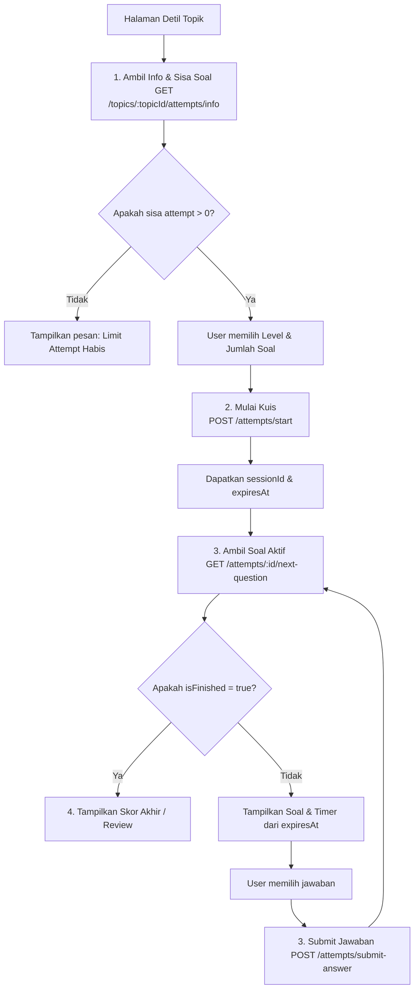

# 🎮 Panduan Integrasi Game Loop & Quiz Attempt (Untuk Frontend)

Semua endpoint pengerjaan soal di bawah ini memerlukan header **`Authorization: Bearer <JWT_TOKEN>`** karena terikat dengan user yang sedang login.

---

## 🔄 Alur Utama (Flow Sequence)



---

## 1. Pre-flight Check (Sebelum Memulai Game)
Sebelum user memulai kuis, FE harus memvalidasi ketersediaan attempt dan sisa soal yang belum pernah dikerjakan oleh user tersebut.

*   **Endpoint**: `GET /api/v1/topics/:topicId/attempts/info`
*   **Tujuan**: Menampilkan info batasan pengerjaan dan sisa soal yang tersedia di tiap level.
*   **Response**:
    ```json
    {
      "code": 200,
      "message": "Success",
      "data": {
        "max_attempts": 3,
        "current_attempts": 1,
        "remaining_attempts": 2,
        "level_settings": [
          {
            "level": "easy",
            "true_score": 10,
            "false_score": -2,
            "total_questions": 15,
            "remaining_questions": 12
          }
        ]
      }
    }
    ```
*   **Tindakan FE**: 
    - Jika `remaining_attempts` bernilai `0`, tombol "Start Quiz" harus di-disable.
    - User tidak boleh memilih jumlah soal (`requestedQuestions`) melebihi `remaining_questions` pada level yang dipilih.

---

## 2. Mulai Kuis (Start Session)
Ketika user menekan tombol "Mulai", kirim request untuk membuat session pengerjaan baru.

*   **Endpoint**: `POST /api/v1/attempts/start`
*   **Request Body**:
    ```json
    {
      "topicId": "uuid-topik-di-sini",
      "level": "easy", // easy, medium, hard
      "requestedQuestions": 5
    }
    ```
*   **Response**:
    ```json
    {
      "code": 200,
      "message": "Success",
      "data": {
        "id": "uuid-session-kuis",
        "userId": "uuid-user",
        "topicId": "uuid-topik",
        "topicName": "Integral",
        "selectedLevel": "easy",
        "requestedQuestions": 5,
        "status": "STARTED",
        "startedAt": "2026-06-10T15:32:56+07:00",
        "expiresAt": "2026-06-10T15:35:26+07:00"
      }
    }
    ```
*   **Tindakan FE**:
    - Simpan `id` (sebagai `sessionId`) dan `expiresAt`.
    - Gunakan `expiresAt` sebagai target waktu hitung mundur global (Global Countdown Timer) untuk seluruh rangkaian soal.
    - Redirect atau masuk ke layar pengerjaan soal.

---

## 3. Game Loop (Mengambil & Menjawab Soal Satu per Satu)
Karena kuis ini bersifat linear, soal tidak dikirimkan sekaligus ke frontend saat start untuk mencegah cheating. FE harus mengambil soal aktif saat ini satu demi satu.

### Langkah A: Ambil Soal Aktif Saat Ini
*   **Endpoint**: `GET /api/v1/attempts/:sessionId/next-question`
*   **Response** (Jika masih ada soal):
    ```json
    {
      "code": 200,
      "message": "Success",
      "data": {
        "isFinished": false,
        "question": {
          "id": "uuid-soal",
          "content": "Berapakah hasil integral dari xdx?",
          "level": "easy",
          "timeLimit": 30,
          "options": [
            { "id": "uuid-opsi-a", "content": "1/2 x^2 + C" },
            { "id": "uuid-opsi-b", "content": "x^2 + C" }
          ]
        }
      }
    }
    ```
    *(Properti `isCorrect` pada pilihan jawaban sengaja disembunyikan oleh backend).*

*   **Response** (Jika semua soal sudah dijawab):
    ```json
    {
      "code": 200,
      "message": "Success",
      "data": {
        "isFinished": true
      }
    }
    ```
    *(Jika `isFinished` bernilai `true`, alihkan ke halaman Review/Skor).*

### Langkah B: Submit Jawaban
Begitu user memilih jawaban, kirimkan jawaban tersebut ke backend.
*   **Endpoint**: `POST /api/v1/attempts/submit-answer`
*   **Request Body**:
    ```json
    {
      "attemptSessionId": "uuid-session-kuis",
      "questionId": "uuid-soal",
      "answerId": "uuid-opsi-pilihan-user"
    }
    ```
*   **Response**:
    ```json
    {
      "code": 200,
      "message": "Success",
      "data": {
        "isCorrect": true,
        "correctAnswerId": "uuid-opsi-yang-benar",
        "isFinished": false, // bernilai true jika ini adalah soal terakhir
        "score": null // bernilai integer skor akhir jika isFinished = true
      }
    }
    ```
*   **Tindakan FE**:
    - Tampilkan feedback benar/salah secara langsung jika diperlukan menggunakan properti `isCorrect` dan `correctAnswerId`.
    - Jika `isFinished` bernilai `true`, arahkan user ke halaman Review.
    - Jika `isFinished` bernilai `false`, hit ulang endpoint **Langkah A (Get Next Question)** untuk menampilkan soal berikutnya.

---

## 4. Penanganan Batas Waktu (Timer Expired)
Waktu pengerjaan bersifat absolut berdasarkan server. Jika timer global (berdasarkan target `expiresAt`) habis:
1. Jika FE mencoba submit jawaban (`POST /submit-answer`) atau meminta soal berikutnya (`GET /next-question`), Backend akan mengembalikan HTTP Status `400 Bad Request` dengan error khusus:
   ```json
   {
     "code": 400,
     "message": "Session Expired",
     "data": "attempt session has expired or finished"
   }
   ```
2. **Tindakan FE**: Jika mendapatkan response `400 Session Expired`, FE harus langsung menghentikan timer, menampilkan pop-up "Waktu Habis", dan mengarahkan user ke halaman Review/Skor Akhir. Skor akhir otomatis terkalkulasi di backend hanya untuk soal-soal yang dijawab sebelum waktu habis.

---

## 5. Review Detail Kuis & Histori (Post-Game)

### A. Melihat Detail Kuis Selesai (Review)
*   **Endpoint**: `GET /api/v1/attempts/:sessionId`
*   **Tujuan**: Menampilkan detail lengkap hasil pengerjaan kuis yang sudah selesai.
*   **Response** (Hanya jika status sudah `FINISHED`):
    - Pada objek `details`, properti `isCorrect` pada masing-masing pilihan jawaban (options) kini akan dimunculkan oleh backend untuk peninjauan (review).
    - Data mencakup: pilihan jawaban user (`selectedAnswerId`), status kebenaran jawaban (`isCorrect`), waktu menjawab (`answeredAt`), dan `score` akhir.

### B. List Histori Attempt User
*   **Endpoint**: `GET /api/v1/attempts`
*   **Query Params** (Optional): 
    - `topicId`: untuk memfilter histori pada topik tertentu saja.
    - `page` dan `limit`: pagination.
*   **Response**: Mengembalikan list attempt milik user yang sedang login beserta skor dan status kelulusannya secara global.

---

## 6. Filter Topik Berdasarkan Classroom
Ketika menampilkan daftar topik di halaman kelas tertentu, filter topik berdasarkan classroom ID wajib dikirimkan.
*   **Endpoint**: `GET /api/v1/topics`
*   **Query Params**:
    - `classroomId` (Optional): UUID classroom untuk menyaring topik yang masuk ke dalam kelas tersebut.

---

## 7. Leaderboard & Peringkat Kelas
Leaderboard menampilkan peringkat siswa berdasarkan akumulasi nilai kuis di kelas (hanya pengguna dengan role `student` yang diperhitungkan).
*   **Endpoint**: `GET /api/v1/leaderboard`
*   **Query Params**:
    - `classroomId` (Required): UUID classroom.
    - `topicId` (Optional): UUID topic. Jika dikirimkan, leaderboard hanya menghitung skor tertinggi untuk topik tersebut. Jika dikosongkan, leaderboard menghitung akumulasi total skor tertinggi tiap topik di kelas (Global Kelas).
*   **Response**:
    ```json
    {
      "code": 200,
      "message": "Success",
      "data": [
        {
          "user_id": "uuid-siswa-1",
          "username": "siswa_kece",
          "first_name": "Budi",
          "last_name": "Setiawan",
          "profile_picture_url": "https://res.cloudinary.com/...",
          "score": 1200,
          "rank": 1
        },
        {
          "user_id": "uuid-siswa-2",
          "username": "siswi_pintar",
          "first_name": "Ani",
          "last_name": null,
          "profile_picture_url": null,
          "score": 950,
          "rank": 2
        }
      ]
    }
    ```

---

## 8. Manajemen Member Kelas & Keluar Kelas

### A. Keluar dari Classroom (Leave Classroom)
Siswa atau pengajar dapat keluar dari kelas secara mandiri. Owner kelas dilarang menggunakan endpoint ini (harus transfer ownership atau menghapus kelas).
*   **Endpoint**: `POST /api/v1/classrooms/:classroomId/leave`
*   **Response**:
    ```json
    {
      "code": 200,
      "message": "Success",
      "data": "Successfully left the classroom"
    }
    ```

### B. Update Role Member (Hanya untuk Owner)
Owner kelas dapat mempromosikan/mendemosikan member lain (menjadi `teacher` atau `student`).
*   **Endpoint**: `PUT /api/v1/classrooms/:classroomId/members/:userId`
*   **Request Body**:
    ```json
    {
      "role": "teacher" // ATAU "student"
    }
    ```
*   **Response**:
    ```json
    {
      "code": 200,
      "message": "Success",
      "data": "Member role updated successfully"
    }
    ```

### C. Mengeluarkan Member / Kick (Oleh Owner / Teacher)
Mengeluarkan member dari classroom. Teacher dilarang mengeluarkan sesama teacher atau owner.
*   **Endpoint**: `DELETE /api/v1/classrooms/:classroomId/members/:userId`
*   **Response**:
    ```json
    {
      "code": 200,
      "message": "Success",
      "data": "Member removed successfully"
    }
    ```